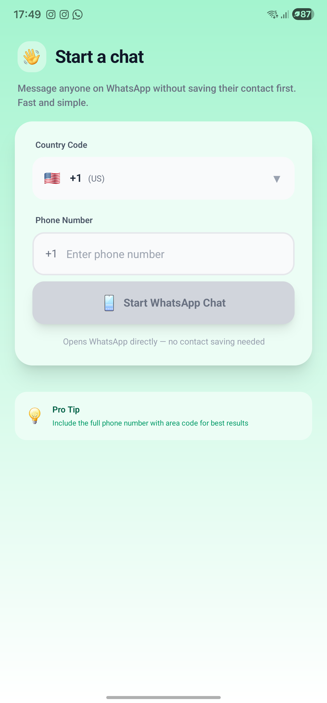
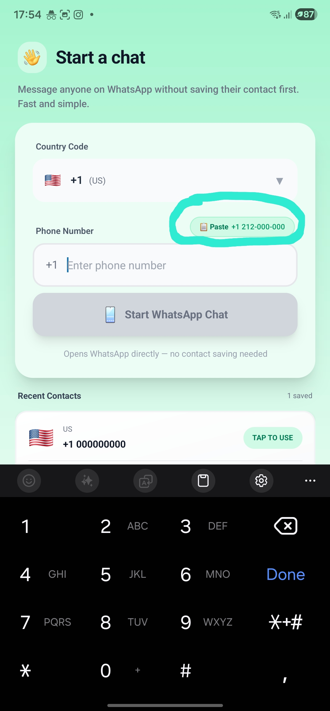
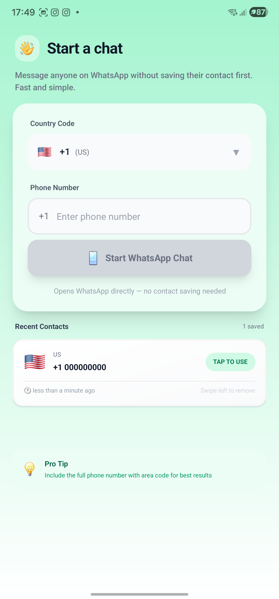

# Atomic IQ 💬

A fast, lightweight React Native app to start WhatsApp chats without saving the phone number to your contacts first. Built with **Expo**, **NativeWind (Uniwind)**, and **SQLite**.

## ✨ Features

- **Instant Chat**: Enter a number and start chatting immediately.
- **No Contact Saving**: Keep your phonebook clean.
- **Smart Clipboard**: Automatically detects phone numbers from your clipboard on app open.
- **Recent History**: Keeps a local history of recent numbers (stored securely on-device).
- **Swipe Actions**: Swipe left to remove numbers from history.
- **Country Code Support**: Auto-detects and formats numbers correctly.
- **Dark Mode**: Fully supported UI.

---

## 📸 Screenshots

|                                Home Screen                                |                                     Smart Clipboard                                      |                                   Start Chat                                   |
| :-----------------------------------------------------------------------: | :--------------------------------------------------------------------------------------: | :----------------------------------------------------------------------------: |
|  |  |  |

|                                     Recent Contacts                                      |                                     Swipe to Delete                                      |
| :--------------------------------------------------------------------------------------: | :--------------------------------------------------------------------------------------: |
|  |  |

---

## 🛠️ Tech Stack

- **Framework**: [Expo SDK 54](https://expo.dev) + [React Native 0.81](https://reactnative.dev)
- **Styling**: [TailwindCSS](https://tailwindcss.com) + [Uniwind](https://uniwind.dev)
- **State Management**: [Zustand](https://github.com/pmndrs/zustand)
- **Database**: [Expo SQLite](https://docs.expo.dev/versions/latest/sdk/sqlite/)
- **Animations**: [React Native Reanimated](https://docs.swmansion.com/react-native-reanimated/) + [Gesture Handler](https://docs.swmansion.com/react-native-gesture-handler/)
- **Icons**: [Lucide React Native](https://lucide.dev)

---

## 🚀 Getting Started

### Prerequisites

- [Node.js](https://nodejs.org/) (LTS recommended)
- [Yarn](https://yarnpkg.com/) or Bun
- [Expo Go](https://expo.dev/client) app installed on your phone.

### Installation

1. **Clone the repository**

   ```bash
   git clone https://github.com/dannysofftie/atomiciq.git
   cd atomiciq
   ```

2. **Install dependencies**

   ```bash
   yarn install
   # or
   bun install
   ```

### 🏃‍♂️ Run Locally (Expo Go)

Start the development server:

```bash
yarn start
```

- Scan the QR code with the **Expo Go** app (Android) or Camera app (iOS).
- Press `a` to open in Android Emulator or `i` to open in iOS Simulator.

---

## 📦 Building for Production

### Android APK (Direct Install)

To build a standalone APK that can be installed directly on an Android device:

```bash
yarn build:android
```

This will generate `build/atomiciq.apk`. You can transfer this file to your phone and install it.

### Android App Bundle (Play Store)

To build an `.aab` file for Google Play Store testing/release:

```bash
yarn build:android:aab
```

This will generate `build/atomiciq.aab`.

---

## 📱 Project Structure

```sh
src/
├── app/                 # Expo Router file-based navigation
├── components/          # Reusable UI components
├── db/                  # SQLite database setup and queries
├── hooks/               # Custom React hooks (e.g., useSmartClipboard)
├── store/               # Zustand state management store
└── global.css           # Tailwind/Uniwind global styles
```

## 🤝 Contributing

Contributions are welcome! Feel free to open issues or submit pull requests.

1. Fork the repo.
2. Create feature branch: `git checkout -b feature/AmazingFeature`
3. Commit changes: `git commit -m 'Add AmazingFeature'`
4. Push to branch: `git push origin feature/AmazingFeature`
5. Open a Pull Request.

---

## 📄 License

Distributed under the MIT License.
